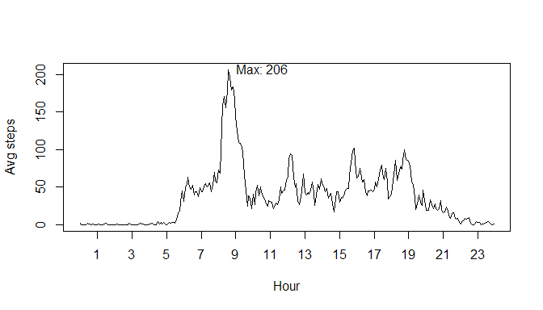

## Analysis of number of steps walked by a person through the day  
  
In this report we are analyzing data about how many steps a person walks through the day. The data we have got was collected in 5-minute intervals for two months, and refers to a single person.  
  
Our first step is to load any library we are using:

```r
library(lubridate)
```

```
## 
## Attaching package: 'lubridate'
```

```
## The following object is masked from 'package:base':
## 
##     date
```

```r
library(ggplot2)
```
  
  
((1)) Now for our analysis, first of all we need to unzip, read the file, and prepare de data:  


```r
unzip("repdata_data_activity.zip")
data <- read.csv("activity.csv", header=TRUE,sep=",", na.strings="NA")
data$fullTime <- ymd_hm(paste(data$date,
                              as.character(floor(data$interval/100)),
                              as.character(data$interval - 100* (floor(data$interval/100) ) ),
                              sep=" "))

data$hour <- floor(data$interval/100) +
  (100/60)*(data$interval/100-(floor(data$interval/100)))
```

((2)) Our first analysis will be to evaluate how many steps walks a person per day:  


```r
# pasos diarios
DayTotal <- aggregate(steps ~ date, data=data,FUN=sum)
hist(DayTotal$steps, main="Daily steps",xlab="Steps")
```

<!-- -->

```r
# media y mediana pasos diarios
meanDaySteps <- format(mean(DayTotal$steps,na.rm=TRUE), nsmall=1,scientific = FALSE)
medianDaySteps <- format(median(DayTotal$steps,na.rm=TRUE), nsmall=1,scientific = FALSE)
```

((3)) The mean daily steps is **10766.19** and the median is **10765**.  

But, how is the evolution during the day? ((4)) This plot show us the average number of steps in each 5-minute interval thorgh the day:  

```r
#Media por intervalo
IntMean <- aggregate(steps ~ hour, data=data,FUN=mean)

plot(IntMean,type="l",xaxt="n",xlab="Hour",ylab="Avg steps")
axis(1,at=seq(from=1,to=23,by=2))
#El maximo:
maxInt <- IntMean[IntMean$steps==max(IntMean$steps),]
text(x=maxInt$hour,y=maxInt$steps, pos=4, labels=paste("Max:",round(maxInt$steps)))
```

<!-- -->

((5)) Here we can see that the interval that contains, on average, greatest number of steps is at **8.5833333** hours and has **206.1698113** steps on average.  
  
But, there are many NAs in our dataset:  

```r
# NAs en el fichero:
nNAs <- sum(is.na(data$steps))
pctNAs <- 100* sum(is.na(data$steps))/nrow(data)
```
  
((6)) A total of **2304** 5-minute intervals without data, which represents **13.1147541 % ** of total.  

((6b) Then, we are estimating those values using the interval average over all days.  

```r
# Estimacion de los NAs:
# Criterio: la media en ese tramo horario
dataFill <- data

for (i in 1:nrow(dataFill) ) { 
  if (is.na(dataFill$steps[i])) {
    dataFill$steps[i] <- IntMean[IntMean$hour==dataFill$hour[i],"steps"]
  }
}
```
  
((7)) And using this new dataset, the daily steps histogram changes a little bit:  

```r
# Con los nuevos datos, pasos diarios:
DayTotalFill <- aggregate(steps ~ date, data=dataFill,FUN=sum)
hist(DayTotalFill$steps, main="Daily steps",xlab="steps")
```

<!-- -->

```r
#Media y mediana del nº de pasos diarios
mean_dayStepsN <- format(mean(DayTotalFill$steps,na.rm=TRUE), nsmall=1,scientific = FALSE)
median_dayStepsN <- format(median(DayTotalFill$steps,na.rm=TRUE), nsmall=1,scientific = FALSE)
```

But new mean and median values are the same or quite the same than they were before fulfilling NAs values: **10766.19** and **10766.19** respectively, (before fulfilling they where: 10766.19 and 10765). Why? This is because NAs values are located in a few days, which have no data for any interval. So before fulfilment those days hadn't total value, the full day is stimated using the mean of other days.
  
  
((8)) And finally, let's analyze if there are differences between weekdays and weekend days.  

```r
# Vamos a ver la distribución por dia de la semana:
dataFill$dType <- weekdays(dataFill$fullTime)
dataFill$dType <- replace(dataFill$dType,
                          which(dataFill$dType %in% c("lunes","martes","miércoles","jueves","viernes")),
                          "weekday")
dataFill$dType <- replace(dataFill$dType,
                          which(dataFill$dType %in% c("sábado","domingo")),
                          "weekEND")

g <- ggplot(dataFill,aes(hour,steps)) +
  facet_grid(dType ~ .) +
  stat_summary(fun.y=mean,geom="line")
print(g)
```

<!-- -->

And we can see that the distribution actually differs between working days and weekends.
  
  
